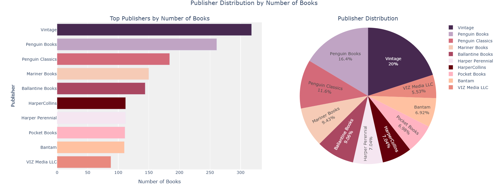
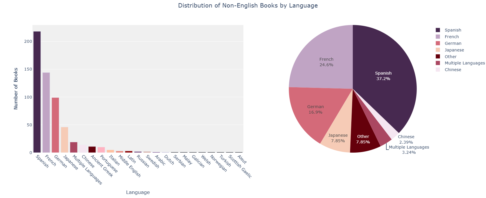
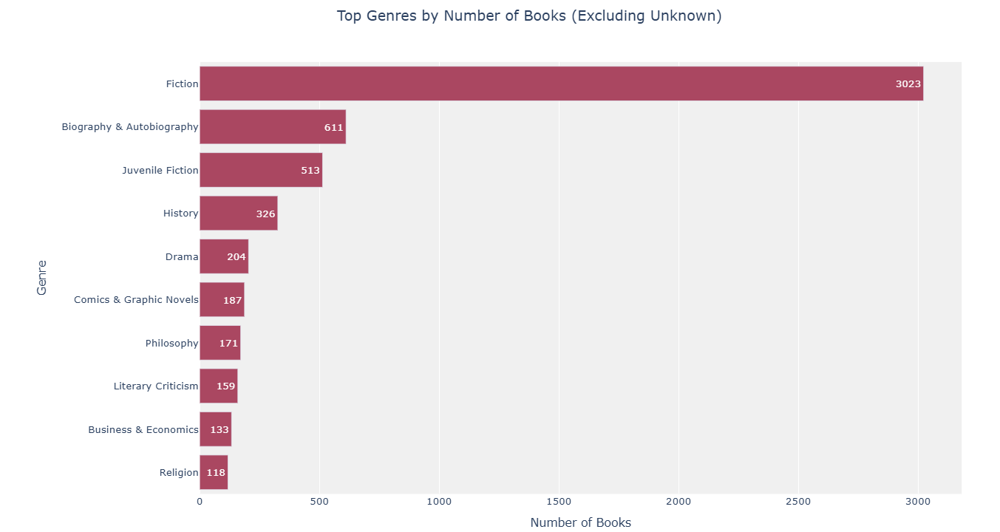

# Goodreads-Data-Analysis
Goodreads data analysis project

This project focuses on analyzing data from Goodreads, with a particular emphasis on enriching the dataset by classifying book genres using the Google Books API. The analysis includes exploration of book metadata, extraction of genres, and visualization of various trends.

---

## Project Overview

The main goal of this project is to:

- Perform data analysis on books and quotes from Goodreads.
- Enrich the dataset with genre and description information using the Google Books API.
- Explore how different genres relate to user ratings, reviews, and other metadata.
- Visualize insights using clear and meaningful plots.

---

## Datasets Used

### 1. Goodreads Books Dataset
- **Source**: [jealousleopard/goodreadsbooks](https://www.kaggle.com/datasets/jealousleopard/goodreadsbooks)
- **Contents**: Title, author, average rating, number of pages, ISBN, publication date, and more.
- This dataset is the primary source for analyzing books.

### 2. Goodreads Quotes Dataset
- **Source**: [abhishekvermasg1/goodreads-quotes](https://www.kaggle.com/datasets/abhishekvermasg1/goodreads-quotes)
- **Contents**: Quotes, authors, and tags.
- Used to study themes and sentiments associated with books and authors.

---

## Genre Classification with Google Books API

The original book dataset lacked genre information. To address this, the project uses the [Google Books API](https://developers.google.com/books) to enrich each book entry with:

- **Genre**: Extracted from the `categories` field in the API response.
- **Description**: Extracted from the `description` field for contextual understanding.

A function `get_book_info_from_google_books(isbn)` sends a request for each ISBN and parses the response. The function handles missing data and rate limits (HTTP 429) gracefully by using retries and delays.

Another function `classify_books(df, isbn_column)` applies this API call to the entire dataset and appends two new columns: `genre` and `description`.

---

## Visualizations

A few sample visualizations included in the project:

Plots are created using `matplotlib`, `seaborn`, and optionally `plotly`.

---

## License

This project is for educational and non-commercial purposes. Dataset licenses belong to their respective authors on Kaggle.
